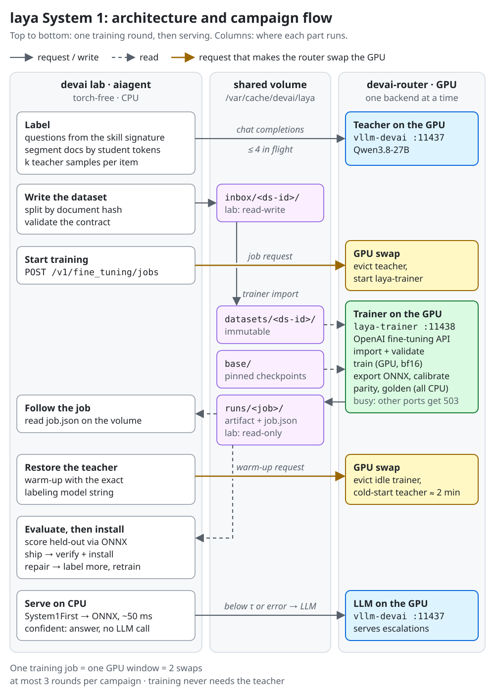

# laya as aiagent's System 1: evaluation and distillation design

**Status:** design. Owner decisions recorded 2026-09-24. Nothing is implemented yet.
**Scope:** aiagent (dataset building, CPU inference, cascade) and devai (GPU trainer backend, router
changes, shared volume).
**Sources:** laya v0.3.20 (commit `23a1752`, HF revision
`55cf4c4ebb4ebe31b2550e8bdf3bd21b99753851`), measurements on this host (Core Ultra 9 285, 24
cores, RTX PRO 4000 Blackwell 24 GB), and read-only reviews of both repos. The measurement
scripts are listed in the [appendix](#appendix-a-measured-facts).

---

## 1. Summary

laya is an open-source, non-autoregressive "System 1" decision model, launched on 2026-09-18 as
an open alternative to TypeSafe's closed Jev. It answers typed questions (`choice`, `score`,
`noul`) over a text in one encoder pass, in 24-130 ms on CPU, with no text generation.

Measured on aiagent's own tasks, the **shipped checkpoints are not usable zero-shot**: accuracy
is barely above always guessing the most common label, and confidence does not separate right
answers from wrong ones. laya's own README agrees: "a fast base to specialise, not a zero-shot
decision engine". Its headline result is itself a distillation from an LLM teacher.

The plan is therefore to **distill**:

1. The devai 27B LLM (the *teacher*) labels documents for the typed outputs of a skill.
2. laya (the *student*) is fine-tuned on those labels on the GPU, while the teacher is swapped out.
3. aiagent runs the trained student on CPU in front of the LLM. It answers the confident cases and
   hands everything else to the LLM.

The work is split by what each repo can do:

- **devai** owns everything that needs torch or GPU control: a trainer image, served as a new
  router backend that speaks the OpenAI fine-tuning protocol.
- **aiagent** stays torch-free and owns:
  - everything that needs DSPy, the skills or the teacher;
  - a small onnxruntime-based runtime for the trained model.
- The two repos exchange **files on a shared volume**. HTTP carries only control messages.

## 2. Owner decisions (2026-09-24)

| # | Decision |
|---|---|
| D1 | The teacher is the existing 27B model, `Qwen3.8-27B-MTP-devai-NVFP4` on the `vllm-devai` backend. No smaller co-resident teacher. |
| D2 | laya is trained on the **GPU** by swapping the teacher out. The trained model runs on **CPU**. |
| D3 | aiagent gets **onnxruntime plus its dependencies** and runs laya inference in-process. No torch in aiagent, ever. |
| D4 | devai gets a **separate trainer image**, built on the **same base image as the lab image**. It is not an extension of `devai-lab-gpu`. |
| D5 | The trainer is a **new router backend**, so GPU switching works the standard way. It speaks the **OpenAI protocol** (the fine-tuning jobs API). |
| D6 | We write **our own training script** rather than using laya's Kaggle notebook. A **controller** inside the trainer image accepts requests and runs jobs. |
| D7 | The router changes proposed in §6.3. **Datasets and artifacts go through a shared volume**, not HTTP uploads. |

## 3. What laya is

- **Model.**
  - A bidirectional encoder: ModernBERT-large (421M parameters) or mmBERT-base (322M parameters,
    197M of which is its 256k-token vocabulary).
  - A 2-layer decision head scores each option at its own `[MASK]` marker.
  - The input is: question header, option markers, then the state.
  - Each (state, question) pair is its own row; all rows go through one batched forward call.
- **Question types.**
  - `choice`: one of N labelled options, with a probability per option.
  - `score`: an ordinal scale, returning a distribution and its expected level.
  - `noul`: P(true).
  - Every answer carries `answer_confidence` (max p, the calibrated quantity) and `confidence`
    (1 minus normalised entropy, not calibrated).
- **Checkpoints.**

  | name | encoder | context | notes |
  |---|---|---|---|
  | `laya` | ModernBERT-large, 421M | 512 | English only |
  | `laya-multilingual` | mmBERT-base, 322M | 1,024 (up to 8,192) | about 2× faster on CPU; ships no fitted temperatures |
  | `laya-typed-decisions` | ModernBERT-large, 421M | 1,024 | fine-tuned on one benchmark |

  - All are Apache-2.0, safetensors only, and downloaded from mutable HF `main` unless pinned.
- **Compared with an LLM:**
  - it is 20-100× smaller;
  - it is deterministic;
  - its output is always a valid label, so there is nothing to parse;
  - it cannot reason, explain, extract spans, compute, or answer outside the options it is given.
- **Compared with Jev:** laya clones Jev's API (`POST /v1/systemone`) and architecture, not its
  quality.
  - On the only paired public test (64 cases in Chinese), Jev scored 64/64 and laya-multilingual
    20/64.
  - The headline "0.766 vs Jev's 0.727" puts a fine-tuned laya against a zero-shot Jev. The
    benchmark's own dataset card calls that comparison misleading, and says that scores above
    about 0.75 mean the model has learned the teacher's quirks.
- **How laya's fine-tune was made.** The typed-decisions benchmark labels are the mean of 3 samples
  at temperature 0.7 from a teacher of roughly 4B size, stored as soft distributions. This is the
  same recipe as §4 below, with a much stronger teacher (27B).
- **Maturity.**
  - The repo was 6 days old at evaluation time, with 25 releases, behaviour changes in patch
    releases, and one maintainer merging AI-assisted PRs quickly.
  - Some documented model defects are frozen in the weights until a retrain:
    - `noul` follows its label words (#156);
    - the multilingual checkpoint has a position bias on `score` (#131);
    - the act head is dead (#185).
  - Its "RLCD" training is supervised learning with a policy-gradient estimator (#238).

### Zero-shot results on aiagent tasks (CPU, hand-labelled before running)

| Task | laya (routed) | Always guessing the most common label |
|---|---|---|
| Sentiment, 5 levels | 6/14 | 4/14 |
| Sarcastic or mixed (`noul`) | recall 0/4; it never said yes | 0/4 |
| Skill routing (chat / extract / sentiment / none) | 6/13; never picked `chat` | 4/13 |
| "Purchase with an amount?" | 7/11 | 6/11 |
| "Merchant named?" | 8/11 | 6/11 |

- **Confidence is barely useful:** AUROC 0.64 for telling right from wrong.
- **Confidently wrong examples:** a Croatian fuel receipt was routed to `extract` at 0.95, and
  "iPhone costs 1,199 dollars" was judged a purchase at 0.95.
- **Language routing:** short Croatian text went to the English checkpoint.
- **Verdict:** use laya only after fine-tuning, and only behind a confidence gate fitted on
  held-out data.

## 4. Architecture



- **Only one backend holds the GPU at a time.**
  - A job request on `:11438` makes the router evict the teacher and start the trainer.
  - The next teacher request evicts the idle trainer and cold-starts vLLM, which takes about 2 min.
- **Swaps.** Each training job is one GPU window, meaning 2 swaps. A campaign has at most 3 rounds,
  so at most 6 swaps. All teacher work is done up front; training, calibration and evaluation
  never need the teacher.

## 5. Campaign flow

1. **Plan.** `aiagent distill plan <skill>` shows which outputs qualify, the derived questions and
   their hashes. No LLM is used.
2. **Label** (teacher up):
   - `aiagent distill label <skill> --source …` ingests the documents;
   - segments them to fit the student's token limit;
   - labels each segment k times with distinct `rollout_id`s at temperature above 0, with at most
     4 requests in flight;
   - adds synthetic examples, splits by document hash, validates, and writes the dataset to
     `inbox/`.
3. **Train.** `aiagent distill train <dataset-id>` sends `POST :11438/v1/fine_tuning/jobs`.
   - The router evicts the teacher and starts the trainer.
   - The controller imports and re-validates the dataset, then trains on the GPU.
   - It then exports to ONNX, calibrates on the ONNX logits, and checks parity and the golden
     answers, all on CPU.
   - The result is written to `runs/<job>/`.
   - The trainer's `/health` reports `busy` until the job ends, and the router holds the GPU for it.
4. **Restore.** When the job ends, aiagent sends a warm-up request to the teacher with the
   **exact** model string used for labeling, including `::reasoning@ctx`. That brings vLLM back in
   the same configuration.
5. **Evaluate.** `aiagent distill eval <run>` verifies the artifact, scores the held-out split
   **through the ONNX runtime**, and returns *ship*, *repair* or *stop*.
6. **Repair** (optional, at most 3 rounds in total): draw more items from the pool split, augment
   them, label with the teacher, and train again.
7. **Install.** `aiagent distill install <run>` fully verifies the artifact once and writes a stamp.
   The gate is then turned on per skill: `off`, then `shadow`, then `gate`.

## 6. devai side

### 6.1 Trainer image (`localhost/devai-laya-trainer`)

- **Base:** `Dockerfile.base`, the same base as the lab, with uv and Python 3.14.7 (D4).
  - laya 0.3.20 works on 3.14.7 with torch 2.14.0 and transformers 5.17.0: a CPU forward and
    backward pass were verified. GPU training on 3.14 is not yet verified.
- **Torch** is installed in its own step: `torch==2.14.0` cu130, the same build as the lab.
  - The build **fails unless `sm_120` is in `torch.cuda.get_arch_list()`**.
  - The rest comes from a hash-locked requirements file: `laya==0.3.20`, `transformers==5.17.0`,
    `onnx`, `onnxscript`, `onnxruntime`, `fastapi`/`uvicorn`.
  - Hash-locked Python requirements are a **new convention in devai**; the lab has no lock.
- **Source layout:** a top-level `laya-trainer/` directory, built the same way `gpu-arbiter/` is.
  It is the Python package `laya_trainer`:

  | module | job |
  |---|---|
  | `controller.py` | FastAPI app implementing §6.2, `/health`, `/v1/models`. Runs one job at a time as a subprocess. |
  | `dataset.py` | Contract check (§8.1): re-tokenizes every row with laya's `build_sequence` and compares the token-id hashes. |
  | `train.py` | The training loop. See §6.6. |
  | `calibrate.py` | Temperature fitting on ONNX fp32 logits of the `calib` split. |
  | `export.py`, `parity.py`, `golden.py` | ONNX export, torch-vs-ONNX parity check, golden answers. |
  | `fixture.py` | Builds aiagent's tiny test model (vocabulary under 1 MB). |

- **Runtime:**
  - on devai-net, because the router must reach it;
  - `HF_HUB_OFFLINE=1`, so no downloads at run time;
  - runs as a non-root user with `--userns=keep-id`, so files on the volume are owned by the host
    user;
  - output also goes to `/var/cache/devai/logs/devai-laya-trainer.log`, because the logger finds
    containers only when it starts.

### 6.2 Controller API (OpenAI fine-tuning subset)

| Method and path | Meaning |
|---|---|
| `POST /v1/fine_tuning/jobs` | Body `{"model":"laya-multilingual","training_file":"ds-<sha12>","hyperparameters":{…},"suffix":"<skill>","metadata":{…}}`. `training_file` is a dataset id in `inbox/` (OpenAI file ids are opaque strings, so no `/v1/files` upload is needed). Returns a `fine_tuning.job` object. |
| `GET /v1/fine_tuning/jobs[/{id}]` | Job object: `status` ∈ validating_files, queued, running, succeeded, failed, cancelled; `fine_tuned_model`; `result_files`; `error`. |
| `GET /v1/fine_tuning/jobs/{id}/events` | Progress lines (epoch, loss, phase). |
| `POST /v1/fine_tuning/jobs/{id}/cancel` | Stops the job. A checkpoint is kept if an epoch finished. |
| `GET /health` | `{"status":"ok"\|"busy","job":…,"phase":…,"hold_until":…}`. The router reads this. |
| `GET /v1/models` | Base checkpoints plus finished runs. |

- **The volume is the source of truth.** Every job writes `runs/<job>/job.json` and
  `events.jsonl`, so aiagent can read the status from the volume when the trainer is not resident.
- **Only one job at a time.** A second POST while one is running returns 409.

### 6.3 Router changes (gpu-arbiter)

1. **A new backend entry** in the backend list (`main.go`, around lines 1704-1770):
   - name `laya-trainer`, port `LAYA_TRAINER_PORT` (default 11438), container `devai-laya-trainer`;
   - image `localhost/devai-laya-trainer:latest`, `HealthPath: "/health"`;
   - `ModelsDir: /var/cache/devai/laya` mounted at `/laya`, `MountRW: true`;
   - an entrypoint function for the controller.
   - The base model names (`laya-multilingual`, `laya-english`) must be registered so the
     model-name allowlist accepts them.
   - Compose, `CACHE_SERVICES`-style lists and the tests change with it.
2. **The trainer cannot be evicted while busy.** Today a request for another backend drains
   in-flight *requests* for up to 30 s and then stops the container. A training run is not a
   request, so it would be killed.
   - While the trainer's `/health` says `busy`, requests to other ports get **503 with
     `Retry-After`** and an OpenAI-style error body, instead of an eviction.
   - The hold has a hard cap, `LAYA_MAX_HOLD_S`. After it the router evicts anyway, and the
     trainer's per-epoch checkpoint limits the loss.
   - **Boot adoption:** after a router restart (for example `make cache-up`), a running busy
     trainer is adopted and held, not overrun. The router's in-memory exclusivity is the GPU lock
     in this design, so this step is required.
3. **Requests with no model** (GET job status or events, POST cancel) on the trainer port are
   proxied to the resident trainer **with no lifecycle decision**, and get 503 if it is not
   resident.
   - Today, POST bodies must be JSON with a `model` field of 32 MB or less, and a body without a
     model surfaces as a 503. That still needs to be checked in `makeRequestHandler`
     (`main.go:3545`).
   - Job-create bodies do carry `model`, so they fit the existing path.
4. **Health detail (small).** Expose `current_context` and `current_spec` in `/health`, so a
   warm-up can recreate exactly what was running.
   - Without this, aiagent's warm-up must use the exact labeling model string, including
     `::reasoning@ctx`, or it can pay a second cold start.
5. **Guard lists.** Add `devai-laya-trainer` to the probers' `MUTEX_CONTAINERS`
   (`scripts/_probe_hf_common.py:133`). That list also still misses `devai-vllm-devai` and
   `devai-ollama`, which is an existing bug.

Tests: Go table tests for the busy hold, the hold cap, boot adoption and model-less proxying,
using the existing `containerStateStub` seam.

### 6.4 Shared volume

- **Layout:** `/var/cache/devai/laya/` with `base/`, `inbox/`, `datasets/`, `runs/`.

| path | lab (aiagent) | trainer | written by |
|---|---|---|---|
| `base/<name>@<rev>/` | – | read | the model pull (§6.5) |
| `inbox/<dataset-id>/` | **read-write** | read | aiagent |
| `datasets/<dataset-id>/` | read | read-write | the trainer, on import. Immutable after that. |
| `runs/<job>/` | read | read-write | the trainer. `chmod -R a-w` after packaging. |

- **The lab mount must be added in both places the lab starts from:** `optional_mounts` in
  `bin/devai-agent`, and `MODEL_CACHE_MOUNT` in the `Makefile`.
- **The lab gets write access only to `inbox/`.** That is new, since model stores are read-only in
  the lab today.
- **Open question:** devai's CLAUDE.md requires a new LV for any new top-level directory under
  `/var/cache/devai`. On this host `/var/cache/devai` is a single LV and the existing stores are
  plain directories on it. See §11.

### 6.5 Base checkpoints

- devai allows exactly one model download path: `make model-pull` / `scripts/select-models.py`.
  - Add a `laya` store and catalog rows with a **pinned revision and sha256**.
  - Otherwise the owner has to amend that rule.
- Run laya's `_fix_tokenizer_config` **once at staging time**. It rewrites `tokenizer_config.json`
  in place, and the trainer mounts `base/` read-only.

### 6.6 Training script (replacing the notebook)

Start from the notebook's cell 8 (RLCD: soft-target cross-entropy plus a policy-gradient term,
using `laya.common` `build_model` / `collate_items` / `proper_reward`). Changes:

- **Single GPU, bf16 autocast, no GradScaler.** The notebook's fp16 plus scaler was for T4s.
- **Default student is `laya-multilingual`.** It is needed for non-English text, about 3× faster
  per training step, and in laya's worked example matched the 421M model after fine-tuning.
- **Memory.** Freeze the 197M-parameter vocabulary embedding and use gradient checkpointing, for an
  estimated 4-5 GiB of VRAM, or the fast mode at about 9-10 GiB. Both are estimates from CPU
  measurements (§A).
- **Token limits.** `max_len` and `head_max_len` come **only from the dataset manifest**. A config
  override exits with code 3. (The notebook trained at 512/192 but saved 1024/256.)
- **Calibration** uses the dataset's `calib` split, not a random slice of training rows.
  Temperatures are fitted in the CPU packaging step on **ONNX fp32 logits**, bounded to
  `[0.5, 5.0]` (laya's runtime clamp). Both raw and applied values are recorded.
- **Weights are saved in fp32** (the notebook uses `.half()`).
- **No silent dropping.** A row whose re-tokenization differs from the dataset's token-id hash
  fails the job with exit code 3.
- **Export.**
  - Opset 18 with dynamic axes, traced with batch ≥ 2, sequence ≥ 300 and ≥ 3 markers. (Upstream
    traces with 1/16/2; its batched export runs about 5× slower.)
  - Parity check, torch against ONNX Runtime on held-out: max absolute probability difference
    ≤ 1e-3.
  - `golden.jsonl` with 40 cases, including expected `input_ids`.
- **Not in the first version:** dynamic int8. It was measured broken, with argmax agreeing with
  fp32 on only 97/133.

**Exit codes:**

| code | meaning |
|---|---|
| 0 | ok |
| 1 | unexpected error |
| 3 | dataset contract violation |
| 4 | base checkpoint missing or hash mismatch |
| 5 | GPU unavailable or out of memory |
| 6 | training diverged |
| 7 | export or parity failure |
| 124 | timeout |

### 6.7 Failure handling

| Failure | Result |
|---|---|
| Job fails or is cancelled | `job.json` gets status and error; the trainer releases GPU memory and goes idle. The next teacher request evicts it normally. |
| Hold exceeds `LAYA_MAX_HOLD_S` | The router evicts. The job is marked failed, with the last checkpoint kept. |
| Trainer container crashes | The router's existing vanished-backend reset applies, and the next request launches whatever it asks for. |
| Router restarts mid-job | Boot adoption keeps the hold (§6.3). |
| Host reboot | Nothing restores the stack automatically: `devai-infra.service` is not installed on this host. `make cache-up` is needed. This problem exists today and is not specific to laya. |

## 7. aiagent side

### 7.1 `aiagent.distill` (DSPy work, torch-free)

| module | job |
|---|---|
| `questions.py` | Derives laya questions from a predictor's `dspy.Signature` (rules below). Pure; no dspy at module level. Computes `signature_sha256` and `question_set_sha256`. |
| `segment.py` | Segments documents using `ingest/`. Caps each segment by **student tokens**, using a tokenizer-only `build_sequence` (tokenizers only, no numpy). `core/segment.py` has no token cap today. |
| `label.py` | k teacher samples per item, each with a distinct `rollout_id` and temperature above 0, and at most 4 in flight (the teacher runs with `--max-num-seqs 4`). The DSPy cache stays on, so an interrupted run resumes. |
| `augment.py` | Synthetic top-up: pick a label, then the LLM writes a passage for it. The teacher relabels every variant, and each variant inherits its parent's `doc_id`. |
| `splits.py` | `sha256(doc_id) mod 100` → train / calib / heldout / pool. Held-out is frozen across rounds and never contains synthetic rows. |
| `dataset.py` | Writes and validates the §8.1 contract. The validation mirrors the trainer's check, so a bad dataset never costs a GPU window. |
| `client.py` | httpx client for the §6.2 API, with `trust_env=False`, a short timeout, and settings for its base URL. |
| `gates.py` | Evaluation through the **ONNX runtime** (§9) and the ship / repair / stop verdict. |

**Which predictors qualify.** A predictor qualifies only if **every** output except `reasoning`
maps to a question:

- **`Literal[...]` with 10 options or fewer → `choice`.**
- **`bool` → a two-option `choice` with neutral keys, decoded back to bool.** A plain `noul` has
  a label-word bias.
- **Bounded `int` with 10 levels or fewer → `score`.** This is the weakest type; prefer the English
  checkpoint for it.
- **`reasoning` is filled with a fixed marker.**
- **The gate is forced off during `optimize`**, because BootstrapFewShot only traces predictors
  that actually ran.

### 7.2 `aiagent.system1` (inference)

- **`runtime.py`: a port of laya's input building and answer decoding** onto onnxruntime,
  tokenizers and numpy.
  - A prototype exists: 198 non-blank lines, identical token ids on 456/456 sequences, 132/133
    answers identical, largest probability difference 1e-4, about 48 ms per decision on CPU.
  - It imports lazily.
  - It needs a mypy override (onnxruntime has no `py.typed`), and fixes for 3 typing errors that
    `--strict` reports.
- **`artifacts.py`: installs and verifies artifacts** in a per-user artifacts directory, with a new
  `artifacts_dir` setting that `clean_env` isolates in tests.
  - Full verification runs **once** at `distill install`:
    - file hashes;
    - bindings recomputed from the current skill;
    - the golden answers, including `input_ids`, within 1e-3;
    - `rl_agent_config` `max_len`/`head_max_len` equal to the dataset manifest.
  - Each later load checks only a stamp (size, mtime_ns, inode, `artifact_id`) and the bindings.
    Hashing 1.3 GB on every CLI start would cost seconds.
- **`cascade.py`: `System1First`, a `dspy.Module` wrapping a qualifying predictor.**
  - Setting `system1_mode` = `off` (default), `shadow` (run both and log agreement), or `gate`.
  - Setting `system1_min_conf`, taken from the artifact's τ.
  - Any runtime error falls back to the LLM.
  - It is never imported by `cli/app`.
- **New dependencies:** `onnxruntime`, `protobuf` and `flatbuffers` (numpy and tokenizers are
  already locked); `make lock` is required.
  - **Bundle growth (x86_64 cp314 wheel):**
    - 61 MB unpacked, of which the 29 MB `libonnxruntime.so` is not needed by the Python module and
      can be stripped;
    - about **+10 MB compressed stripped**, +19 MB unstripped (zstd -19).
  - The strip goes into `STRIP_ABSENT` or an equivalent, with a test; a real build is still to be
    verified.
  - **No new glibc floor:** litellm's native module and numpy already need glibc 2.28.
- **Invariants to keep:**
  - `import aiagent.cli.app` must not import dspy, **numpy, tokenizers, onnxruntime or httpx**;
    the subprocess import test is extended to check this;
  - hermetic tests use a tiny fixture: a tiny tokenizer built in the test plus an ONNX file under
    1 MB, because the real multilingual tokenizer alone is 34 MB;
  - `mypy --strict`, coverage ≥ 85%, and the build's host-path and version audits all still pass.
- **Shipping into the lab:** the lab image bakes in aiagent at build time
  (`Dockerfile.lab:184-198`). A release with onnxruntime needs a lab image rebuild, or a per-user
  install.

### 7.3 CLI

`aiagent distill` is a Typer sub-app with `plan`, `label`, `train`, `status`, `eval`, `repair`
and `install`.

- **Configured by settings, with no devai-specific code:**
  - `trainer_api_base`: an OpenAI-compatible fine-tuning endpoint;
  - `distill_dir`: where the shared inbox, datasets and runs are mounted.
- **Status** comes from the volume first and HTTP second.

## 8. Contracts

**Canonical hashing:** `H(x) = sha256(json.dumps(x, separators=(",", ":"), ensure_ascii=False))`
over an **ordered** structure.

- `choice` criteria are hashed as an ordered `[[key, description], …]` list, because option order
  sets marker positions and decode order.
- `signature_sha256` covers instructions plus inputs and outputs (name, type, description,
  constraints), in declaration order.
- `question_set_sha256` covers the exact laya question JSON in that ordered form.
- `skill_source_sha256` is a **soft** binding: a mismatch drops the gate back to `shadow` until
  `distill eval` passes again.

### 8.1 Dataset (aiagent → devai): `inbox/ds-<sha12>/`

**Files:**
- `manifest.json`
- `train.jsonl`, `calib.jsonl`, `heldout.jsonl`, `pool.jsonl`
- `SHA256SUMS`

**Manifest fields, in two parts:**
- **Laya-generic, owned by devai:**
  - `schema_version: 1`;
  - `base_checkpoint: {name, revision, weights_sha256, tokenizer_sha256}`;
  - `max_len`, `head_max_len`;
  - `splits: {method, counts}`.
- **Opaque `producer` object**, which devai only hashes into `dataset_manifest_sha256`:
  - aiagent version, skill, predictor;
  - the signature and question hashes;
  - `teacher` (the exact model string, k, temperature, dspy 3.2.1, ChatAdapter);
  - sources, augmentation, label statistics.

**Rows** use native JSON, with no JSON strings nested inside JSON:

```json
{"id":"9f2c41d07a1b:0004","group_id":"sha256:9f2c41d07a1b…","split":"train","synthetic":false,
 "state":{"text":"Die Lieferung kam zwei Wochen zu spät, aber der Support war hervorragend."},
 "questions":{"polarity":{"type":"choice","instructions":"Overall sentiment polarity of the passage.",
   "criteria":{"negative":"mostly negative","mixed":"both positive and negative","positive":"mostly positive"}}},
 "gold":{"polarity":{"label":"mixed","probabilities":{"negative":0.25,"mixed":0.625,"positive":0.125}}},
 "teacher":{"k":8,"parse_failures":{"polarity":0}},
 "student_tokens":{"polarity":{"n":71,"ids_sha256":"…"}}}
```

- Probability keys are the choice keys, `"0".."n-1"` for score, or `"false"`/`"true"` for noul.
- Probabilities sum to 1 ± 1e-6, and `label` is the argmax.
- The trainer supports exactly the declared `schema_version`s and exits with code 3 on anything
  else.

### 8.2 Job request (aiagent → devai, HTTP)

```json
POST /v1/fine_tuning/jobs
{"model":"laya-multilingual","training_file":"ds-9f2c41d07a1b",
 "hyperparameters":{"n_epochs":4,"batch_size":8,"learning_rate_multiplier":1.0},
 "suffix":"sentiment-polarity","metadata":{"campaign":"c-…","round":"0"}}
```

### 8.3 Artifact (devai → aiagent): `runs/<job>/`

**Files:**
- `model.onnx` and `model.onnx.data`
- `tokenizer/`
- `rl_agent_config.json`
- `golden.jsonl`
- `manifest.json`
- `SHA256SUMS`
- `NOTICE`
- `checkpoint/`: torch-loadable, stays on the volume

**`manifest.json` fields:**

| field | content |
|---|---|
| `format_version: 1` | |
| `artifact_id` | `H(binds, base revision and weights hash, trainer config hash, file hashes)` |
| `binds` | `signature_sha256`, `question_set_sha256`, `skill_source_sha256`, `dataset_manifest_sha256` |
| `laya` | version and commit |
| `trainer` | image digest, python/torch/transformers/onnx versions, GPU, hyperparameters, seed, wall-clock times |
| `calibration` | split, n, temperatures raw and applied, clamp |
| `export` | opset, precision, dynamic axes |
| `parity` | split, n, max difference, argmax agreement |
| `golden` | n, tolerance |
| `metrics` | torch-side loss only, for information |
| `files` | sha256 and size per file |

The ship decision is **not** made in devai (§9).

### 8.4 Versioning

- **Dataset `schema_version`** is owned by devai.
- **Artifact `format_version`** is owned by devai. aiagent declares the versions it supports and
  ignores any other, falling back to the LLM.
- **aiagent's `questions.py`** has a golden test that pins the derived question JSON and hashes.
  `derive_version` is bumped only on purpose, because any change unbinds every trained student.
- **laya is pinned** by hash in the trainer. aiagent's runtime declares `LAYA_COMPAT = {"0.3.20"}`;
  the golden answers are the real gate.

## 9. Evaluation and the ship gate

- **Where it runs.** In aiagent, through the ONNX runtime, so the model, the export and the port
  are tested together.
- **Metrics per question, against the teacher's argmax on held-out:** accuracy, ECE (on
  `answer_confidence`), Brier score, and **coverage at precision** (0.90 / 0.95 / 0.98).
- **The threshold τ is fitted on `calib`.** On held-out, the *lower* Clopper-Pearson bound of
  precision at τ must reach the target. Using held-out for both τ and the verdict would overstate
  the result.
- **Verdict:**

| verdict | exit | when |
|---|---|---|
| **ship** | 0 | target reached |
| **repair** | 3 | rounds remain and the previous round improved by at least ε |
| **stop** | 4 | otherwise |

- **Honest limit:** without human labels this proves agreement with the teacher, not correctness.
  An optional spot check of about 100 human-labelled items is the only way to measure real
  accuracy.

## 10. Pilot

**No shipped skill qualifies today:**
- `ExtractExpense` outputs are str/str/float.
- `ScoreSegment.score` is an unbounded int (21 levels if bounded), plus a `rationale` output that
  the explain step uses.

**Options:**
- (a) An agent-authored skill with a `Literal` output, e.g. 3-5-level polarity, or ticket triage.
- (b) Split sentiment into a qualifying polarity predictor, with an LLM rationale only for
  escalated segments.

## 11. Owner answers (2026-09-24)

| # | Question | Answer |
|---|---|---|
| 1 | Pilot skill | (a): a new **builtin skill `polarity`** with a `Literal` output, written by the agent. |
| 2 | Shared volume | **`/var/cache/devai/laya` as created**, with the layout in §6.4. |
| 3 | Base checkpoint download | **Extend `select-models.py`** with a `laya` store. |
| 4 | `LAYA_MAX_HOLD_S` | **Set it from a measurement** of the first real training job; until then it is configurable. |
| 5 | `system1_mode` default | **As proposed:** `off` by default, then `shadow`, then `gate`, per skill. |
| 6 | Order of work | **onnxruntime and the runtime go into aiagent now**, shipped with the next release. |
| 7 | Lab | **Rebuild the lab image** after that aiagent release. |

**Delivery:** aiagent's part is implemented on branch `feat/system1-distill`. devai's part (§6) is
proposed as a plan-only pull request to devai (`docs/plans/`), for a later devai session to
implement.

## 12. Scope change in aiagent's CLAUDE.md (applied)

"Deferred: weight finetuning (no torch)" becomes:

> weight fine-tuning happens in devai's trainer backend; aiagent never imports torch. It builds
> datasets and runs trained students through onnxruntime.

---

## 13. Implementation notes (aiagent, 2026-09-24)

These decisions were taken while implementing §7 on branch `feat/system1-distill`. Where they
differ from the sections above, this section wins.

| Topic | As built |
|---|---|
| Pilot skill | Builtin `polarity`: one `dspy.Predict` with `Literal["negative","neutral","mixed","positive"]`. neutral and mixed mean different things, so there are 4 labels. |
| Qualifying predictors | Exactly one `str` input and **exactly one** non-`reasoning` output (`Literal` with 2-10 values, `bool`, or a bounded int with ≤ 10 levels). Multi-output predictors are deferred: the gate certifies each question separately, and two questions at 95% each can accept jointly at about 90%. |
| Augmentation | **Deferred**, which departs from §5 steps 2 and 6. Repair tops up with real documents from the pool instead. The format keeps room for it (`synthetic`, `producer.augmentation`). Accepted for now (see below). |
| Ship gate (§9) | τ is fitted on calib at `fit_precision` = 0.98, stricter than the target, because a τ fitted at exactly the target almost never certifies on held-out (simulated). Ship requires the held-out Clopper-Pearson lower bound ≥ `precision` = 0.95 at α = 0.05, **and** accepted coverage ≥ `min_coverage` = 0.20 (accepted for now, see below). Held-out must hold at least `min_certifiable` rows (59 at 0.95/0.05) or the verdict is stop, and `label` warns below 300 held-out rows. |
| Pool rows | Stored unlabeled. `repair` labels the pool rows the student is least sure of. |
| Paths | `distill_dir` defaults to `/laya`, devai's lab mount of `/var/cache/devai/laya`. Installed students go to `~/.local/share/aiagent/artifacts/system1/skills/<skill>/<predictor>/`. |
| Teacher warm-up | After a job ends it waits out devai's 503 `gpu_held_by_job` (honouring `Retry-After`, default 30 s) with a 5-minute deadline, which covers devai's 30 s "held" cache and the teacher's cold start of about 2 min. |
| Contract with devai | Agreed with the devai session. The reference is `docs/laya-trainer.md` in devai (branch `feat/laya-trainer`, pending push). devai-side choices: nulls allowed inside `questions` only; `pool.jsonl` optional on their side; `artifact_id` = 64 hex; `temperature_by_options: {}` with applied temperatures; job ids `ftjob-` + 24 hex. |
| Tokenizer | aiagent resets `truncation` and `padding` after `Tokenizer.from_file`, and devai copies the tokenizer byte-for-byte, because `save_pretrained` after a truncating call persists truncation into `tokenizer.json`. |
| ONNX export | devai must export with `dynamo=True`: the TorchScript exporter bakes the traced sequence length into a Reshape. |
| Bundle | onnxruntime, protobuf and flatbuffers are added. `capi/libonnxruntime.so*` (29 MB) is stripped, behind a `readelf` NEEDED gate. The installer is **76.6 MB** (up from about 63 MB). |
| Test fixture | A tiny laya-compatible ONNX student (0.34 MB, vocab 400) with golden answers computed by laya itself, from `tools/system1/make_fixture.py`. |

### Revisit later

On 2026-09-25 the owner accepted three departures from this design **for now**, to be revisited:

| Departure | Revisit when | What to decide |
|---|---|---|
| Synthetic augmentation deferred (§5 steps 2 and 6) | After the pilot, if a label is starved (e.g. few `mixed` rows) or coverage is low | Build `distill/augment.py`: reverse generation plus a teacher relabel and a quality check. The format already allows it (`synthetic`, `producer.augmentation`). |
| Ship gate `min_coverage` = 0.20 (a floor the design lacked) | After the pilot's coverage-at-precision numbers | Keep, lower or raise it. It is tunable with `distill eval --min-coverage`. |
| Multi-output predictors deferred (§7.1) | When a real skill needs several closed outputs, e.g. ticket triage | Add a joint gate report (a row counts as accepted only if every question clears τ, and as correct only if all are right), so the certificate matches what the cascade accepts. |

## Appendix A: measured facts

| Fact | Value | Source |
|---|---|---|
| laya CPU latency, warm (multilingual / english, 1 question, p50) | 24 / 52 ms | hands-on `exp_latency.py` |
| laya-serve round trip (english, 2 questions) | 132 ms | hands-on |
| Checkpoint load from cache | 1.5-1.8 s | hands-on |
| ONNX export (multilingual) | 17 s; parity max difference 1e-4; argmax 14/14; fp32 1.29 GB | hands-on `exp_onnx.py` |
| Port prototype | 198 lines; ids 456/456; answers 132/133; about 48 ms per decision | `port/laya_ort.py`, `parity.py` |
| Batched ONNX (traced export) | 24 segments: 5.0 s batched vs 1.07 s one by one | `port/bench.py` |
| int8 dynamic quantization | 325 MB; argmax 97/133, so broken | `port/int8_parity.py` |
| onnxruntime 1.30.0 cp314 x86_64 | wheel 23.6 MB; 61 MB unpacked (29 MB strippable `.so`); zstd -19 18.5 MB, or 9.75 MB stripped | `ortsize`, `ort314` |
| Training activations, fp32, batch 8 (multilingual L512 / L1024; english L512) | 5.8 / 13.0 / 11.3 GB | `trainmem/measure.py` |
| CPU training step, fp32, batch 8 (same three) | 4.3 / 12.5 / 14.0 s; bf16 backward is unsupported on this CPU | `trainmem/measure.py` |
| Estimated GPU footprint (multilingual lean / fast; english lean / fast) | 4-5 / 9-10; 8 / 13 GiB | derived from the rows above |
| vLLM 27B cold start | 119-124 s typical; 20-45 s with warm caches; 268 s first time | `/var/cache/devai/logs/devai-vllm-devai.log` |
| Teacher flags | `--max-num-seqs 4`, `--gpu-memory-utilization 0.96` | devai `deploy/recovery-flags.json` |
| laya on Python 3.14.7 | works (CPU, torch 2.14.0, transformers 5.17.0) | `laya-py314` venv |

The measurement scripts, raw outputs and full reports are kept locally in
`docs/design/laya-system1/` (`handson/`, `trainmem/`, `port/`, `cachecheck/`, `reports/`). The
folder is git-ignored and not published, because it records details of the build host.

## Appendix B: side findings (not part of this feature)

- **aiagent: sentiment resampling is fake by default.**
  - `SentimentModule` sends identical requests; with the default DSPy cache only the first reaches
    the LLM, so `model_uncertainty` is always 0.
  - Reproduced: 5 real calls instead of 13, uncertainty 0.0 instead of 3.559.
  - Fix: a distinct `rollout_id` per sample.
- **aiagent:** the dev `.venv` has drifted from the lock (numpy 2.5.3 vs 2.5.0 pinned; tiktoken
  0.14.0 vs 0.13.0).
- **devai:**
  - The probers' `MUTEX_CONTAINERS` misses `devai-vllm-devai` and `devai-ollama`.
  - `devai-infra.service` is not installed, so nothing auto-restores after a reboot.
  - Doc drift:
    - `docs/aiagent.md:86` and `Dockerfile.lab:184` say the aiagent bundle carries CPython 3.13;
    - `CLAUDE.md:388` says the launcher sets `AIAGENT_CONTEXT`;
    - `make cache-services-check` does not exist.
